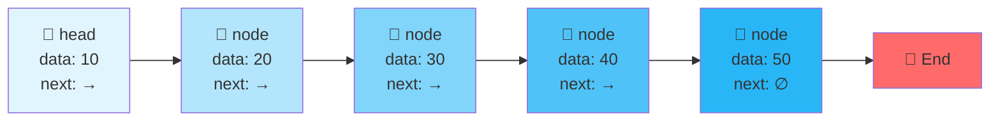

```mermaid
graph LR
    A["🔵 head<br/>data: 10<br/>next: →"] --> B["🔵 node<br/>data: 20<br/>next: →"]
    B --> C["🔵 node<br/>data: 30<br/>next: →"]
    C --> D["🔵 node<br/>data: 40<br/>next: →"]
    D --> E["🔵 node<br/>data: 50<br/>next: ∅"]
    E --> F["🛑 End"]

    style A fill:#e1f5ff
    style B fill:#b3e5fc
    style C fill:#81d4fa
    style D fill:#4fc3f7
    style E fill:#29b6f6
    style F fill:#ff6b6b
```
