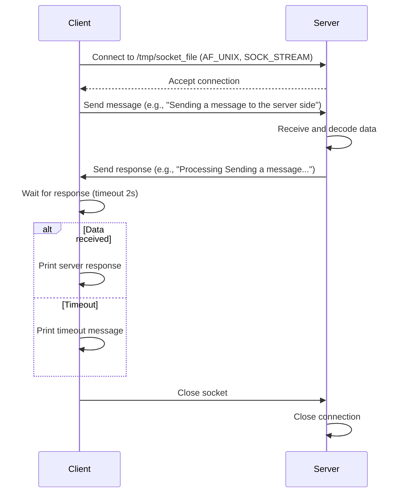

# Local Chat Messenger Sequence Diagram

```mermaid
sequenceDiagram
    participant Client
    participant Server

    Client->>Server: Connect to /tmp/socket_file (AF_UNIX, SOCK_STREAM)
    Server-->>Client: Accept connection

    Client->>Server: Send message (e.g., "Sending a message to the server side")
    Server->>Server: Receive and decode data
    Server->>Client: Send response (e.g., "Processing Sending a message...")

    Client->>Client: Wait for response (timeout 2s)
    alt Data received
        Client->>Client: Print server response
    else Timeout
        Client->>Client: Print timeout message
    end

    Client->>Server: Close socket
    Server->>Server: Close connection
```
