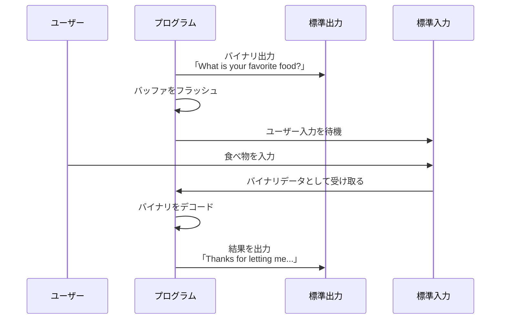

# バッファフラッシュとは

**バッファフラッシュ**は、メモリ上に一時保存されているデータを実際の出力先（画面やファイルなど）に即座に送り出す処理です。

## なぜ必要なのか

通常、プログラムが出力するデータは効率化のため**バッファ（一時保存領域）**に蓄積されます。バッファが満杯になるか、プログラムが終了するまで、実際には画面に表示されません。

しかし、このコードのようにユーザー入力を待つ場合、質問を先に画面に表示しないと、ユーザーは何を入力すればよいか分かりません。

## このコードでの役割

```python
sys.stdout.buffer.write(b"What is your favorite food?\n")
sys.stdout.flush()  # ← ここで質問を即座に表示
food = sys.stdin.buffer.readline()  # その後、入力を待つ
```

`sys.stdout.flush()` がなければ、質問が画面に表示される前にプログラムがユーザー入力を待ってしまい、ユーザーは何もできなくなります。

## 実装的なベストプラクティス

このような対話的なプログラムでは、通常は `print()` 関数を使う方が簡潔です。`print()` は自動的に出力を扱うため、フラッシュを明示的に呼ぶ必要がありません。
