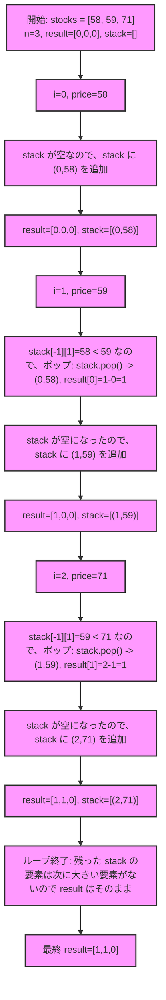

```mermaid
flowchart TD
    A["開始: stocks = [58, 59, 71]<br>n=3, result=[0,0,0], stack=[]"] --> B["i=0, price=58"]
    B --> C["stack が空なので、stack に (0,58) を追加"]
    C --> D["result=[0,0,0], stack=[(0,58)]"]
    D --> E["i=1, price=59"]
    E --> F["stack[-1][1]=58 < 59 なので、ポップ: stack.pop() -> (0,58), result[0]=1-0=1"]
    F --> G["stack が空になったので、stack に (1,59) を追加"]
    G --> H["result=[1,0,0], stack=[(1,59)]"]
    H --> I["i=2, price=71"]
    I --> J["stack[-1][1]=59 < 71 なので、ポップ: stack.pop() -> (1,59), result[1]=2-1=1"]
    J --> K["stack が空になったので、stack に (2,71) を追加"]
    K --> L["result=[1,1,0], stack=[(2,71)]"]
    L --> M["ループ終了: 残った stack の要素は次に大きい要素がないので result はそのまま"]
    M --> N["最終 result=[1,1,0]"]

    classDef note fill:#f9f,stroke:#333,stroke-width:2px;
    class A,B,C,D,E,F,G,H,I,J,K,L,M,N note;
```
