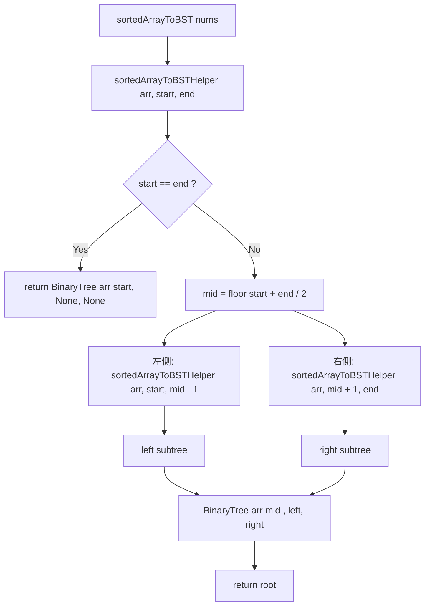

# 📅 2026-04-07 (火曜日)

## ✅ 今日やったこと

- X

## ◽️ 気づき・メモ

- X

## ◽️ 疑問・後で調べたい

- X

## ◽️ 感想・ふりかえり

- X

"""
Mermaid diagram: sortedArrayToBST の処理フロー

```mermaid
flowchart TD
    A[sortedArrayToBST nums] --> B[sortedArrayToBSTHelper arr, start, end ]
    B --> C{start == end ?}
    C -->|Yes| D[return BinaryTree arr start, None, None]
    C -->|No| E[mid = floor start + end / 2]
    E --> F[左側: sortedArrayToBSTHelper arr, start, mid - 1 ]
    E --> G[右側: sortedArrayToBSTHelper arr, mid + 1, end ]
    F --> H[left subtree]
    G --> I[right subtree]
    H --> J[BinaryTree arr mid , left, right]
    I --> J
    J --> K[return root]
```

"""
