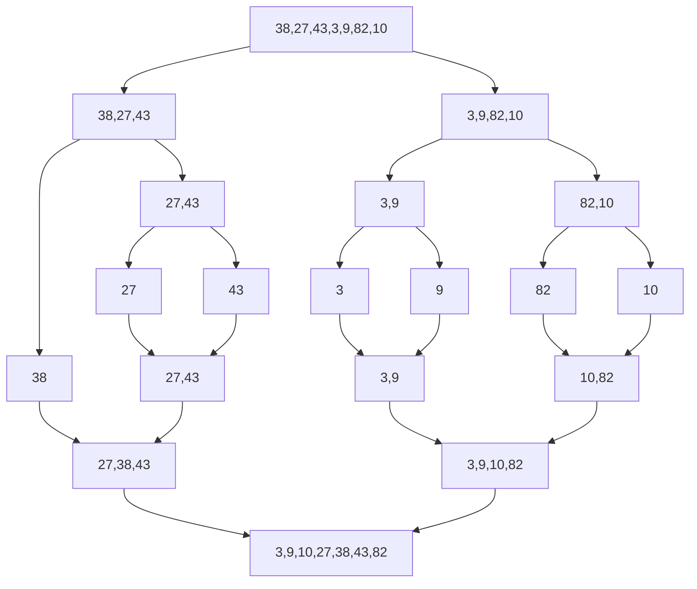

```mermaid
graph TD
  A[38,27,43,3,9,82,10]
  A --> B[38,27,43]
  A --> C[3,9,82,10]

  B --> D[38]
  B --> E[27,43]
  E --> F[27]
  E --> G[43]

  C --> H[3,9]
  C --> I[82,10]
  H --> J[3]
  H --> K[9]
  I --> L[82]
  I --> M[10]

  %% 転置・マージ (比較して統合)
  %% merge 27 & 43 => [27,43]
  F --> N[27,43]
  G --> N[27,43]

  %% merge 38 and [27,43] => [27,38,43]
  D --> O[27,38,43]
  N --> O[27,38,43]

  %% merge 3 & 9 => [3,9]
  J --> P[3,9]
  K --> P[3,9]

  %% merge 82 & 10 => [10,82]
  L --> Q[10,82]
  M --> Q[10,82]

  %% merge [3,9] and [10,82] => [3,9,10,82]
  P --> R[3,9,10,82]
  Q --> R[3,9,10,82]

  %% 最終出力
  O --> S[3,9,10,27,38,43,82]
  R --> S[3,9,10,27,38,43,82]
```
