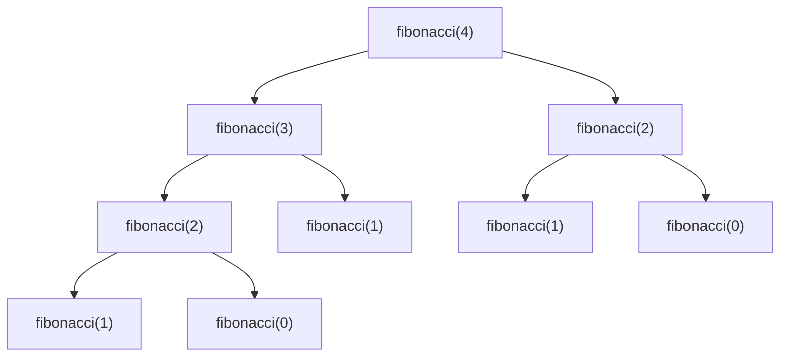
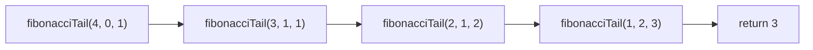

いい質問です！
**末尾再帰（Tail Recursion）** と **ヘッド再帰（Head Recursion）** の違いを、わかりやすく例とたとえで説明します。

---

## ✅ 違いのざっくりイメージ

| 種類       | いつ再帰呼び出す？ | 再帰後に処理はある？                     | イメージ               |
| ---------- | ------------------ | ---------------------------------------- | ---------------------- |
| ヘッド再帰 | 最初に呼び出す     | 再帰「**から戻ってきたあと**」に処理する | **「あとで片付ける」** |
| 末尾再帰   | 最後に呼び出す     | 再帰後に何もしない                       | **「すぐ渡して進む」** |

---

## 🔁 コードで比較

### ◉ ヘッド再帰（Head Recursion）

```ts
function headPrint(n: number): void {
  if (n === 0) return;
  headPrint(n - 1); // ← 先に再帰呼び出し
  console.log(n); // ← 戻ってきてから処理
}
```

#### 🧠 出力順：

```
1
2
3
4
5
```

→ **再帰の「戻りがけ」に処理してる**

---

### ◉ 末尾再帰（Tail Recursion）

```ts
function tailPrint(n: number): void {
  if (n === 0) return;
  console.log(n); // ← 先に処理
  tailPrint(n - 1); // ← 最後に再帰呼び出し
}
```

#### 🧠 出力順：

```
5
4
3
2
1
```

→ **再帰の「行きがけ」に処理してる**

---

## 🧺 たとえ：皿洗いで説明 🍽

- **ヘッド再帰**：全部の皿を積んでから、**最後の皿から順に洗う**（後でやる）
- **末尾再帰**：1 枚洗ってから、次の皿に進む（すぐやる）

---

## ✅ 結論

| 特徴                 | ヘッド再帰           | 末尾再帰                 |
| -------------------- | -------------------- | ------------------------ |
| 再帰の後に処理がある | ある                 | ない                     |
| スタックが必要       | 多く使う             | 最適化可能（TCO）        |
| 書きやすさ           | わかりやすいが非効率 | 最適化しやすいが構造注意 |

---

必要があれば、図での視覚化や練習問題も用意できます！

[chatGPT でのやり取り](https://chatgpt.com/share/686fd238-2a40-8012-92b5-e517d53dd754)

---

- 末尾再帰なし

```typescript
function fibonacci(n: number): number {
  if (n <= 1) return n;
  return fibonacci(n - 1) + fibonacci(n - 2);
}
```



- 末尾再帰

```typescript
function fibonacciTail(n: number, a: number = 0, b: number = 1): number {
  if (n === 0) return a;
  if (n === 1) return b;
  return fibonacciTail(n - 1, b, a + b);
}
```


