OK。では**本当に一行ずつ**、
**具体例 `[0,1,2,3,4], n=2` を固定**して説明します。
抽象の話は一切しません。

---

# 対象コード（これを上から順に読む）

```python
def removeNthNode(head, n):
    if n == 0:
        return head

    dummy = Node(0)
    dummy.next = head

    fast = slow = dummy

    for _ in range(n + 1):
        if fast is None:
            return head
        fast = fast.next

    while fast:
        fast = fast.next
        slow = slow.next

    slow.next = slow.next.next

    return dummy.next
```

---

# 具体例の前提

```text
入力リスト: 0 → 1 → 2 → 3 → 4 → END
n = 2（末尾から2番目を削除 → 3）
```

---

## ① `if n == 0: return head`

```python
if n == 0:
    return head
```

### 何をしてる？

- 「末尾から 0 番目」は意味不明
- **何もせず返す**

👉 今回 `n=2` なので **通過**

---

## ② dummy を作る

```python
dummy = Node(0)
dummy.next = head
```

### ここでの状態

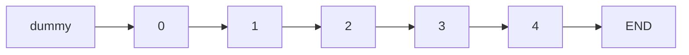

### dummy の意味（超重要）

- **head の 1 個前に仮ノードを置く**
- 削除を「常に同じ形」にするため

👉 **dummy 自体は最終的に捨てる**

---

## ③ fast と slow を dummy に置く

```python
fast = slow = dummy
```

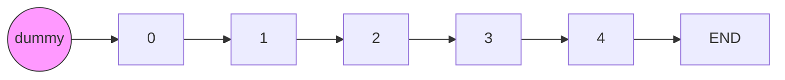

👉 **2 つとも同じ位置からスタート**

---

## ④ fast を n+1 個進める

```python
for _ in range(n + 1):
    if fast is None:
        return head
    fast = fast.next
```

### なぜ n+1？

👉 **slow を「削除対象の 1 つ前」に置きたいから**

---

### 移動を 1 回ずつ追う

#### 1 回目

```
fast = fast.next
```

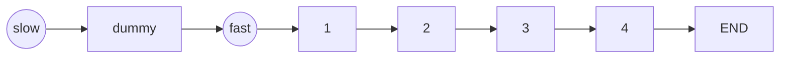

---

#### 2 回目

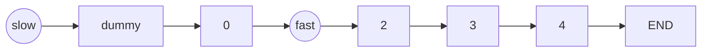

---

#### 3 回目（n+1 = 3）

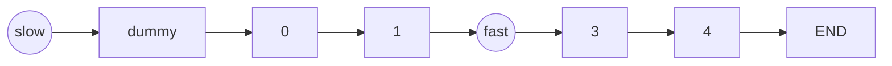

---

### この時点での重要ポイント

```text
fast と slow の距離 = 3 ノード
```

👉 この「距離」が後で効いてくる

---

## ⑤ fast と slow を同時に動かす

```python
while fast:
    fast = fast.next
    slow = slow.next
```

### ゴール

👉 **fast が END に到達したとき**
👉 **slow が「削除対象の 1 つ前」**

---

### 1 回目

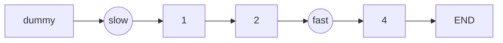

---

### 2 回目

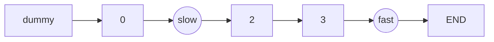

---

### 3 回目

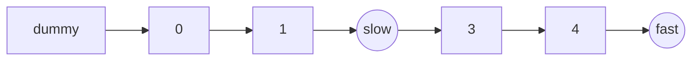

---

## ⑥ ここで何が起きてる？

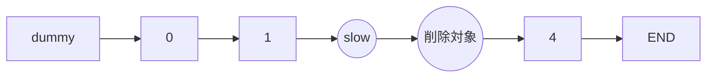

### 状態

- `slow.next` → 削除したい **3**
- `slow.next.next` → **4**

---

## ⑦ 削除の 1 行（ここが本質）

```python
slow.next = slow.next.next
```

### やってること

```text
2.next = 3.next
```

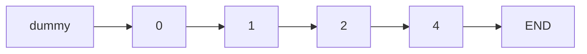

👉 **3 が参照されなくなり、消える**

---

## ⑧ dummy を外して返す

```python
return dummy.next
```

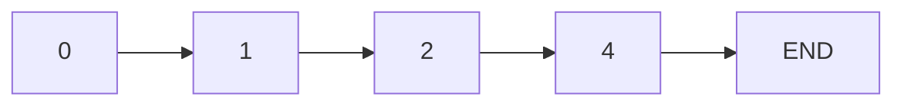

---

# まとめ（これだけ覚えて）

### このアルゴリズムの本質は 1 つだけ

> **「fast を先に n+1 進めておくと、slow が削除位置の 1 つ前に止まる」**

だから

```python
slow.next = slow.next.next
```

が **必ず安全にできる**

---

## まだモヤっとするなら次の一手

次はどれやる？

1️⃣ **n=リスト長（先頭削除）を同じ図で追う**
2️⃣ **dummy を使わないとどこで壊れるか**
3️⃣ **この処理を自分で書くための思考手順**

正直、① を見ると一気に腹落ちします。
