いい題材です。
これは **「片方向リストの反転」**で、LinkedList 理解の集大成みたいなコードです。
**1 行ずつ・状態がどう変わるか**を固定例で説明します。

---

## 前提（具体例）

```text
入力:
3 → 2 → 1 → 5 → 6 → 4 → END
```

---

## コード全体（先に再掲）

```python
def reverseLinkedList(head):
    prev = None
    current = head

    while current is not None:
        next = current.next
        current.next = prev
        prev = current
        current = next

    return prev
```

---

# 全体イメージ（先に結論）

```text
before: 3 → 2 → 1 → 5 → 6 → 4 → END
after : 4 → 6 → 5 → 1 → 2 → 3 → END
```

---

# ① 初期状態

```python
prev = None
current = head
```

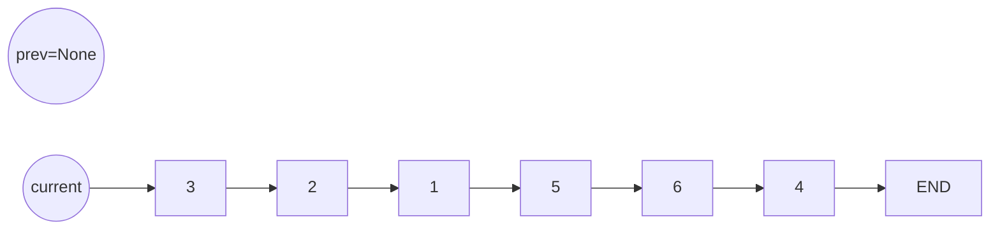

### 役割

- `current`：今処理しているノード
- `prev`：すでに「反転が終わった側」

---

# ② while 1 回目（current = 3）

```python
next = current.next
```

👉 **次を退避（超重要）**

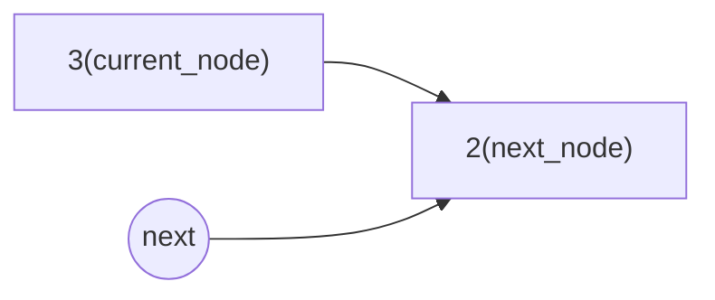

---

```python
current.next = prev
```

👉 **矢印を逆向きにする**

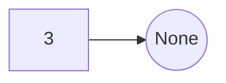

---

```python
prev = current
current = next
```

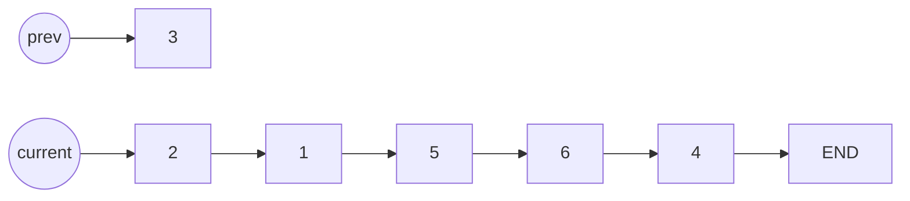

---

# ③ while 2 回目（current = 2）

```python
next = current.next
```

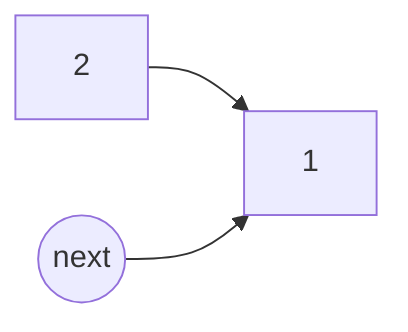

```python
current.next = prev
```

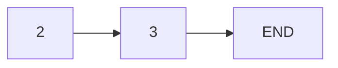

```python
prev = current
current = next
```

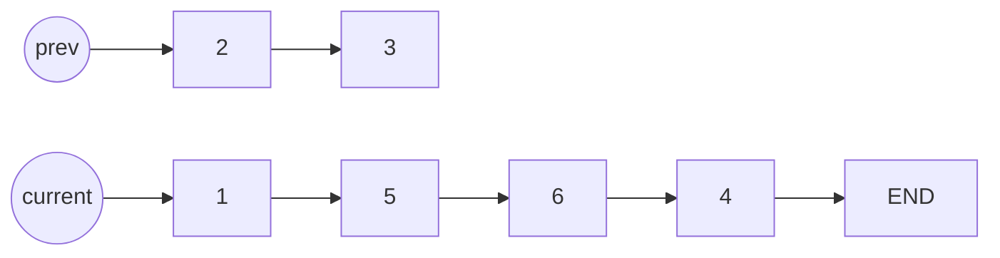

---

# ④ while を回し続けると…

### 途中状態（概念）

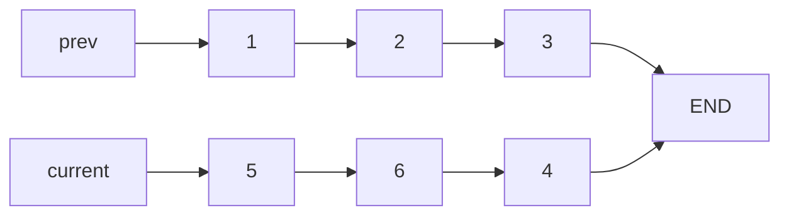

---

### 最終ループ終了時

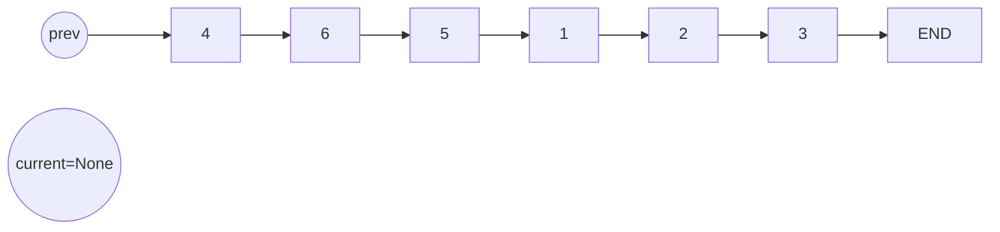

---

# ⑤ return prev の意味

```python
return prev
```

👉 `prev` が **新しい head**

```text
4 → 6 → 5 → 1 → 2 → 3 → END
```

---

# なぜ head ではなく prev を返す？

### ループ終了時

```text
current = None
prev = 元リストの最後のノード
```

👉 それが **反転後の先頭**

---

# このアルゴリズムの本質（超重要）

## 実はやってることはこれだけ

```
① next を退避
② 矢印を逆に向ける
③ ポインタを1つずらす
```

---

## だからこの順番は絶対に崩せない

```python
next = current.next     # 退避しないと迷子
current.next = prev     # 反転
prev = current
current = next
```

---

# 実務での対応関係（FastAPI 視点）

| LinkedList  | 実務                 |
| ----------- | -------------------- |
| prev        | 処理済みデータ       |
| current     | 処理中               |
| next        | 未処理キュー         |
| next を退避 | トランザクション安全 |

---

# 一言で覚えるなら

> **「current の矢印をひっくり返しながら前に積み上げる」**

---

次に理解が固まるのは 👇
🔹 **next を保存し忘れたら何が壊れるか**
🔹 **再帰版 reverse と iterative の違い**

どっち行きます？

いいところまで来てます 👍
このコード、**発想はかなり近い**ですが、**決定的に 1 行足りなくて、1 行順番が違う**ため
**「反転」ではなく「何も変わらない or 壊れる」状態**になっています。

落ち着いて、**何が起きているかをそのまま追います。**

---

# 結論を先に

このコード 👇

```python
reversed_head = current_node
reversed_head.next = next_node
```

は実質、

```text
「current_node をそのまま next_node につなぎ直しているだけ」
```

👉 **向きが一切変わっていません**

---

# 何が足りないか（核心）

**LinkedList を反転するために必須なのはこれ 👇**

> **「current_node.next を “前のノード” に向ける」**

でも今のコードには
👉 **「前のノード」を表す変数が存在していない**

---

# 具体例で完全に追う

## 入力

```text
3 → 2 → 1 → END
```

---

## 初期状態

```python
reversed_head = None
current_node = 3
```

---

## 1 ループ目

```python
next_node = current_node.next   # 2
reversed_head = current_node    # reversed_head = 3
reversed_head.next = next_node  # 3.next = 2（元と同じ）
current_node = next_node        # current_node = 2
```

### 状態

```text
3 → 2 → 1 → END
```

👉 **何も変わっていない**

---

## 2 ループ目も同じ

```text
3 → 2 → 1 → END
```

---

## 最終的に

```python
return reversed_head  # 1番最後に代入されたノード
```

👉 たまたま最後のノードが返るだけ
👉 **反転は起きていない**

---

# なぜ「prev（反転済み側）」が必要なのか

正しい反転は 👇

```python
current_node.next = reversed_head
```

ここが **本質**。

あなたのコードでは 👇

```python
reversed_head.next = next_node
```

になっている。

---

## この違いを図で見る

### ❌ 今のコード

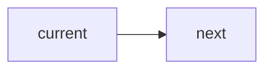

（向きが変わらない）

---

### ✅ 正しい反転

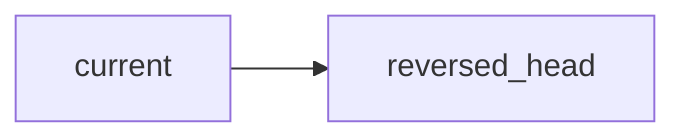

（矢印を逆にする）

---

# 正しい形（あなたの命名を活かす）

```python
def reverseLinkedList(head):
    reversed_head = None
    current_node = head

    while current_node is not None:
        next_node = current_node.next          # ① 次を退避
        current_node.next = reversed_head      # ② 向きを反転（←ここが欠けてた）
        reversed_head = current_node            # ③ 反転側の先頭を更新
        current_node = next_node                # ④ 次へ進む

    return reversed_head
```

---

# なぜこの順番でないとダメか

1️⃣ `next_node` を先に覚えないと後ろを失う
2️⃣ **今のノードの矢印を逆に向ける**
3️⃣ それを「反転済みリスト」として確定
4️⃣ 次へ進む

👉 **1 行でも順番を変えると壊れる**

---

# 今回のあなたのコードの評価（正直）

これは 👇

> **「反転アルゴリズムを“理解しようとして自分で再構成した”コード」**

で、めちゃくちゃ良い段階です。

- prev（反転済み側）が必要だと気づける直前
- 丸暗記では絶対にここに来れない

---

## 次の一歩（超おすすめ）

👉 **「なぜ reversed_head = current_node だけでは足りないのか」**
👉 **「prev があることで何が保存されているのか」**

この 2 点が腑に落ちると、
LinkedList の操作は **一生忘れません**。

どっちをもう一段深掘りする？

めちゃくちゃ良いところまで来てます。
**今の混乱ポイントは「1 つだけ」**です。
そこをピンポイントで直します。

---

# まず結論（超重要）

> **1 回目のループが終わった時点で
> reversed_head は「3」になっている → 正しい**

ただし
👉 **途中のイメージに 1 か所だけ誤解がある**

---

# その誤解ポイント

あなたのこの理解 👇

> `current_node.next -> 2 -> reversed_head(Noneから2に変更)`

ここだけ **違います**。

---

# 正しい 1 回目のループを「値と矢印」で厳密に追う

## 初期状態

```text
reversed_head = None
current_node = 3

3 → 2 → 1 → 5 → 6 → 4 → END
```

---

## ① `next_node = current_node.next`

```text
next_node = 2
```

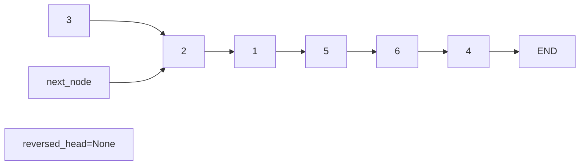

---

## ② `current_node.next = reversed_head`

```python
current_node.next = reversed_head
```

**ここが核心**

```text
3.next = None
```

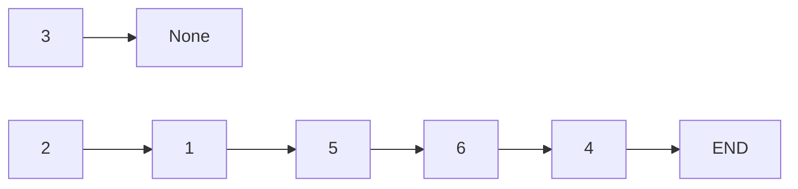

❗ **「3 → 2」ではなくなる**

---

## ③ `reversed_head = current_node`

```text
reversed_head = 3
```

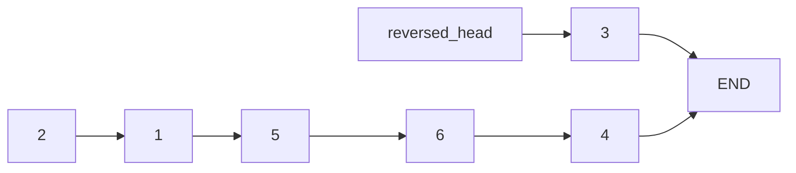

---

## ④ `current_node = next_node`

```text
current_node = 2
```

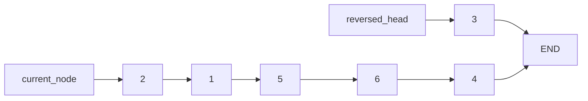

---

# ここで整理（超重要）

### 1 回目ループ終了時

- `reversed_head` → **3**
- `3.next` → **None**
- 元の `3 → 2` の矢印は **完全に消えている**

👉 **ここがあなたのイメージとズレていた点**

---

# あなたの質問に答えると

> reversed_head って None → 2 → 3 になる？

❌ **ならない**

✔️ **None → 3**

---

## なぜ 2 にならない？

`reversed_head` は
👉 **一度も 2 を代入されていない**

```python
reversed_head = current_node  # current_node は 3
```

---

# 2 回目ループを軽く見ると

```text
current_node = 2
next_node = 1
2.next = 3
reversed_head = 2
```

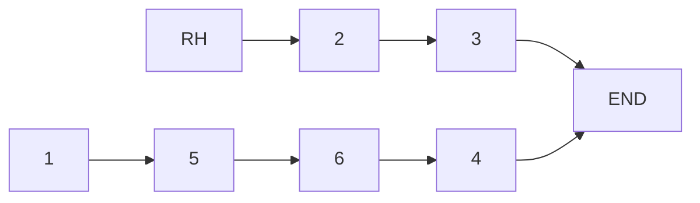

---

# 最終的に

```text
4 → 6 → 5 → 1 → 2 → 3 → END
```

---

# ここで一番大事な理解

> **reversed_head は「積み上がっていく先頭」
> None → 3 → 2 → 1 → 5 → 6 → 4**

「2 → 3」ではない
「3 → None」から始まる

---

## もしまだモヤっとするなら（最後の一押し）

### この 1 文だけ覚えてください

> **「reversed_head は常に “完成済み部分の先頭”」**

---

ここまで理解できたら、LinkedList の reverse は
**もう一生分かってます**。

次は
🔹 **紙に描かずに説明できるかテスト**
🔹 **FastAPI で同じ構造を探す**

どっち行きます？
